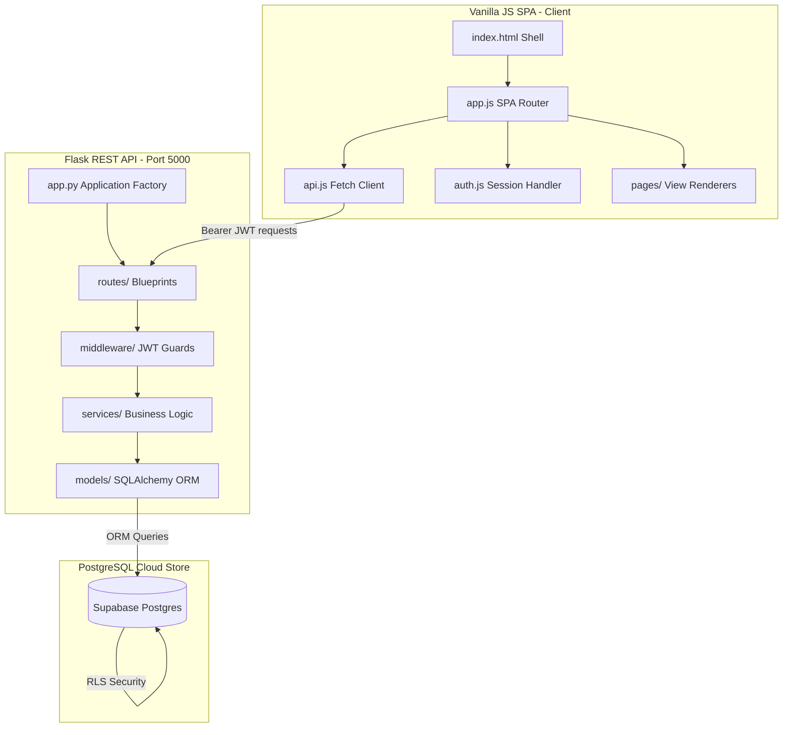

# FluentlyAI | AI English Learning Platform

FluentlyAI is a production-ready, beautiful, and secure **Authentication + Onboarding + Role-Based Dashboard System** designed for high-performance university and SaaS speech training programs.

Built with a stunning glassmorphic Vanilla JS Single-Page Application (SPA) frontend and a modular, robust Python Flask REST API backend, the platform is integrated with Supabase PostgreSQL, Row Level Security (RLS), and JWT sessions.

---

## 🏛️ System Architecture Overview



---

## 📂 Project Directory Structure

```text
c:\PROJECTS\English Learning project/
 ├── database/
 │    └── schema.sql                # Complete Supabase PostgreSQL schema, RLS, and seeds
 ├── backend/
 │    ├── app.py                    # Flask server entry point & sandbox db seed loader
 │    ├── requirements.txt          # Python dependencies
 │    ├── .env.example              # Sample environment variables config
 │    ├── .env                      # Active environment configurations
 │    ├── config/
 │    │    └── config.py            # Configuration variable loader
 │    ├── models/
 │    │    ├── base.py              # Base Model with serialization helpers
 │    │    └── profile.py           # Profiles, StudentProfiles, and FacultyProfiles definitions
 │    ├── middleware/
 │    │    └── auth_middleware.py   # JWT decorators and role validators
 │    ├── routes/
 │    │    ├── auth.py              # User logins, registrations, and resets
 │    │    ├── student.py           # Student profile queries and onboarding submissions
 │    │    └── faculty.py           # Faculty metrics, analytics, and lookups
 │    ├── services/
 │    │    ├── auth_service.py      # Encryption, credential checks, and token signing
 │    │    ├── student_service.py   # Onboarding writes and student mutations
 │    │    └── faculty_service.py   # Analytical aggregates and student searches
 │    └── utils/
 │         └── helpers.py           # Standard JSON response formatting & email check inputs
 ├── frontend/
 │    ├── index.html                # Single-page application viewport shell
 │    ├── css/
 │    │    └── style.css            # Stunning global glassmorphic design system
 │    └── js/
 │         ├── app.js               # Central SPA routing director & route guards
 │         ├── api.js               # REST client with JWT injectors and auth interceptors
 │         ├── auth.js              # Token and user state local session store
 │         ├── components.js        # Sidebar navigations, welcome headers, and skeleton screens
 │         └── pages/
 │              ├── landing.js      # Beautiful modern product landing presentation
 │              ├── auth_pages.js   # State-driven login, signup, and reset forms
 │              ├── onboarding.js   # Student 4-step wizard & Faculty details form
 │              ├── student_db.js   # Student dashboard with simulated speech recording
 │              └── faculty_db.js   # Faculty metrics panels and student directory tables
 └── README.md                      # Complete system documentation
```

---

## 🧪 Standard Sandbox Test Accounts

The local database is **automatically pre-seeded** upon first server startup with standard test accounts. You can log into these accounts immediately:

| Role | Email Address | Password | Onboarding Status |
| :--- | :--- | :--- | :--- |
| **Faculty Admin** | `sarah.faculty@college.edu` | `password123` | Completed (Onboarded) |
| **Student (Advanced)** | `alex.student@college.edu` | `password123` | Completed (Onboarded) |
| **Student (Intermediate)** | `priya.student@college.edu` | `password123` | Completed (Onboarded) |
| **Student (New)** | `ethan.student@college.edu` | `password123` | Pending Onboarding |

---

## 🛠️ Local Development Setup

### Prerequisites
- Python 3.8 or higher
- Node.js (only for quick static file server serving, optional)

### Step 1: Install Backend & Run Server
1. Open a terminal and navigate to the backend folder:
   ```bash
   cd backend
   ```
2. Install Python dependencies:
   ```bash
   pip install -r requirements.txt
   ```
3. Boot the Flask API Server:
   ```bash
   python app.py
   ```
   *The server will run on `http://127.0.0.1:5000`. On first load, it will automatically generate the local SQLite database (`app.db`) and seed the sandbox accounts listed above.*

### Step 2: Serve the Frontend SPA
Since the frontend uses native ES modules (`type="module"`), it must be served using an HTTP server to avoid CORS file-origin restrictions.
1. Serve using a quick server runner from the `frontend` folder:
   - **With Python**: `python -m http.server 3000` (Runs on `http://localhost:3000`)
   - **With Node (Serve)**: `npx serve -l 3000` (Runs on `http://localhost:3000`)
2. Open your browser and navigate to `http://localhost:3000` or `http://127.0.0.1:3000`.

---

## 🌐 Production Cloud Deployment Guide

### 1. Database Deployment (Supabase)
1. Go to the [Supabase Console](https://supabase.com) and create a new project.
2. Under the **SQL Editor**, paste the entire contents of `database/schema.sql` and click **Run**.
3. This creates all relational tables (`profiles`, `student_profiles`, `faculty_profiles`), sets up the auto-timestamp triggers, configures indices, and establishes secure **Row Level Security (RLS)** policies.
4. Copy your PostgreSQL Connection String under Project Settings -> Database -> Connection string -> URI.

### 2. Backend Deployment (Render or Railway)
1. Commit the `backend/` directory to a GitHub repository.
2. In the [Render Dashboard](https://render.com), create a new **Web Service** and link your GitHub repo.
3. Configure settings:
   - **Build Command**: `pip install -r backend/requirements.txt`
   - **Start Command**: `python backend/app.py`
4. Set Environment Variables in Render:
   - `FLASK_ENV`: `production`
   - `DATABASE_URL`: *Your Supabase PostgreSQL URI*
   - `JWT_SECRET_KEY`: *Use a secure generated hash*
   - `SECRET_KEY`: *Use a secure generated session hash*
5. Save changes. Render will deploy the backend API and provide an active URL (e.g. `https://fluently-api.onrender.com`).

### 3. Frontend Deployment (Vercel or Netlify)
1. In `frontend/js/api.js`, update the `BASE_URL` variable to point to your active production Backend API:
   ```javascript
   const BASE_URL = 'https://your-backend-api.onrender.com';
   ```
2. Commit the `frontend/` directory to GitHub.
3. Go to [Vercel](https://vercel.com) or [Netlify](https://netlify.com) and select **Import Repository**.
4. Set the **Root Directory** to `frontend`.
5. Click **Deploy**. Since the app uses hash-based routing (`#/login`, `#/dashboard`), refreshments work automatically without requiring complex rewriting protocols.
